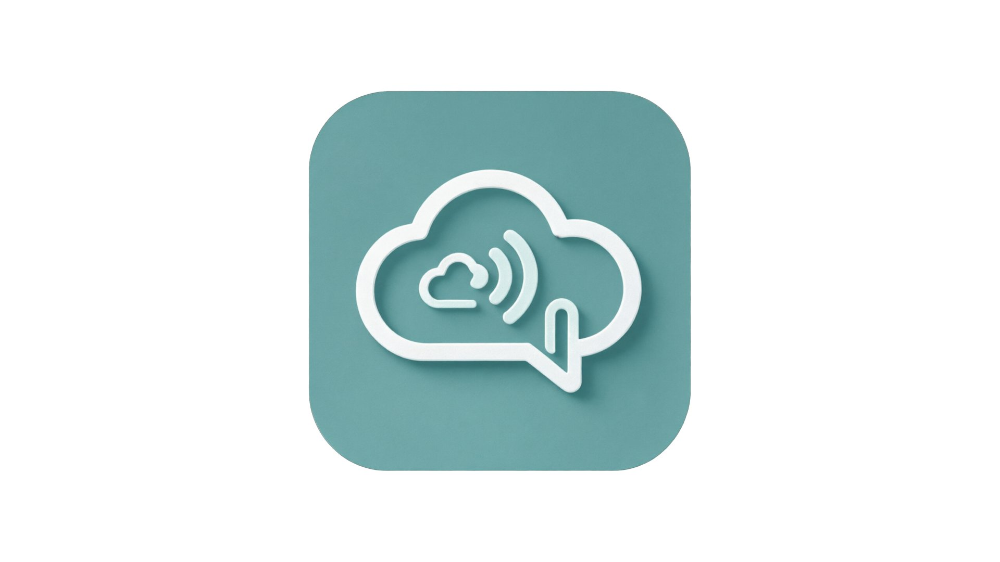
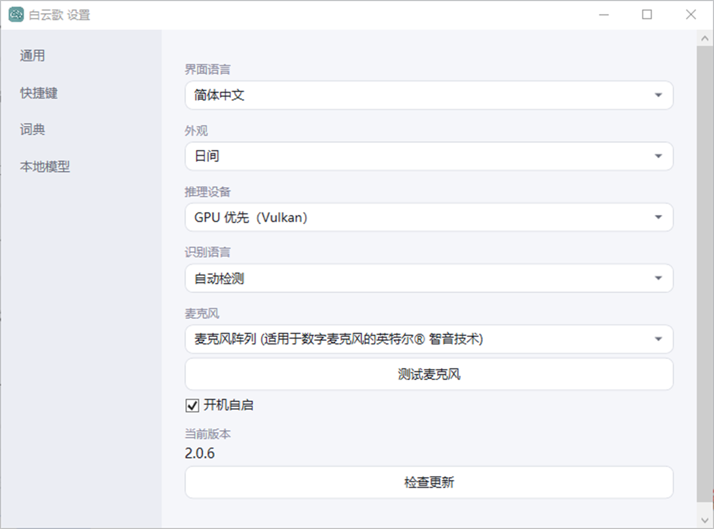

<div align="center">



# 白云歌 BaiYunGe

**Windows 10/11 x64 离线语音快速输入软件**

按住快捷键说话，松开即上屏。识别全程在本机完成，音频与文本不出设备。


</div>

## 界面预览



## 功能特性

- **离线识别**：本地 Qwen3-ASR-1.7B 模型 + 内置 llama.cpp 推理（Vulkan GPU 加速，多显卡机器自动优先独立显卡，无独显自动回退 CPU）
- **两种快捷键模式**：按住说话松开识别（hold，默认）/ 点按开始再按结束（toggle）；默认快捷键 `Ctrl+Win`，支持自定义录制
- **直接上屏**：识别文本以 SendInput 键入当前焦点输入框；焦点不可输入时自动复制到剪贴板并粘贴
- **词典热词**：自定义「别名 → 目标词」映射，识别结果自动替换，同时作为提示词提升专有名词识别准确率
- **识别语言**：自动检测中英文，也可固定中文/英文（独立于界面语言）
- **中英双语界面 + 日间/夜间主题**：实时切换，主题覆盖设置窗口与状态浮窗
- **不抢焦点状态浮窗**：倾听中 → 转化中 → 已输入/错误，全程状态可见，绝不打断当前操作
- **模型软件内一键下载**：hf-mirror / huggingface 白名单镜像、断点续传、大小 + SHA-256 校验、失败自动重试 3 次、空闲超时保护
- **模型预热 + 保活**：启动即预热、模型下载完立即预热、每 5 分钟健康检查自动重启，首次识别与后续一样快
- **软件内检测更新**：自动检测 GitHub 新版本并展示更新日志，一键下载静默覆盖安装，**保留全部配置**；卸载则彻底清除痕迹
- **开机自启动**：勾选即写入注册表，随系统静默启动到托盘

## 工作原理

```
按住唤醒键 → WASAPI 录音（统一 16kHz/16bit/单声道）→ llama-server 离线识别 → 词典替换 → 键入上屏 / 剪贴板
```

- 除模型下载外不访问任何网络；识别音频与文本不离开本机
- 推理服务只监听 `127.0.0.1` + 动态端口，不开放局域网
- 短于 0.3 秒的误触自动丢弃，静音停条、Esc 取消、点按停止随时可控

## 安装

1. 前往 [Releases](https://github.com/bilibilibaiyun/BaiYunGe/releases/latest) 下载 `白云歌_BaiYunGe_x.x.x_x64_Setup.exe`
2. 双击安装（中文向导，可选安装目录，支持「新建文件夹」）
3. 首次运行自动进入「本地模型」页，点击「安装模型」下载语音模型（约 2.4 GB，默认保存到软件安装目录 `models` 下；若目录不可写自动回退用户数据目录）
4. 之后软件静默驻留托盘，按住 `Ctrl+Win` 说话即可

升级：软件内「检查更新」一键覆盖安装，词典、主题等配置完整保留；通过安装包重装则会重置配置。

## 从源码构建

环境：Windows 10/11 x64 + .NET 8 SDK。

```powershell
dotnet test BaiYunGe.sln -c Release
dotnet publish src/BaiYunGe/BaiYunGe.csproj -c Release -r win-x64 --self-contained true -o artifacts/publish
```

免安装运行：`artifacts\publish\BaiYunGe.exe`。

## 调试参数

```text
--settings         启动时打开设置
--data-dir <目录>  指定运行数据目录
```

## 数据目录

运行数据（日志 / 配置 / 临时音频）按以下顺序选择第一个可用位置：

1. `<用户主目录>\BaiYunGe`（主目录不在 C 盘时）
2. `D:\Users\<当前用户>\BaiYunGe`
3. `%LOCALAPPDATA%\BaiYunGe`
4. 程序目录 `.data`

模型默认保存在**软件安装目录下的 `models` 子目录**；该位置不可写时自动回退到数据目录的 `Models`。

## 技术要点

- **UI**：.NET 8 WPF（原生，无浏览器内核/WebView2/Electron），中英双语，日间/夜间双主题
- **音频**：NAudio 2.2.1（唯一第三方依赖）WASAPI 共享模式，任意设备格式统一转 16kHz/16bit/单声道
- **推理**：内置 llama.cpp `llama-server.exe`，Vulkan GPU 优先（自动选独显）+ CPU 回退，全核线程，仅 loopback
- **输入**：SendInput Unicode 直接键入，剪贴板 + 自动粘贴兜底
- **安装**：Inno Setup 7，自包含运行时（目标机无需预装 .NET），Win10/11 x64 通用

## 许可证

[MIT](LICENSE)
